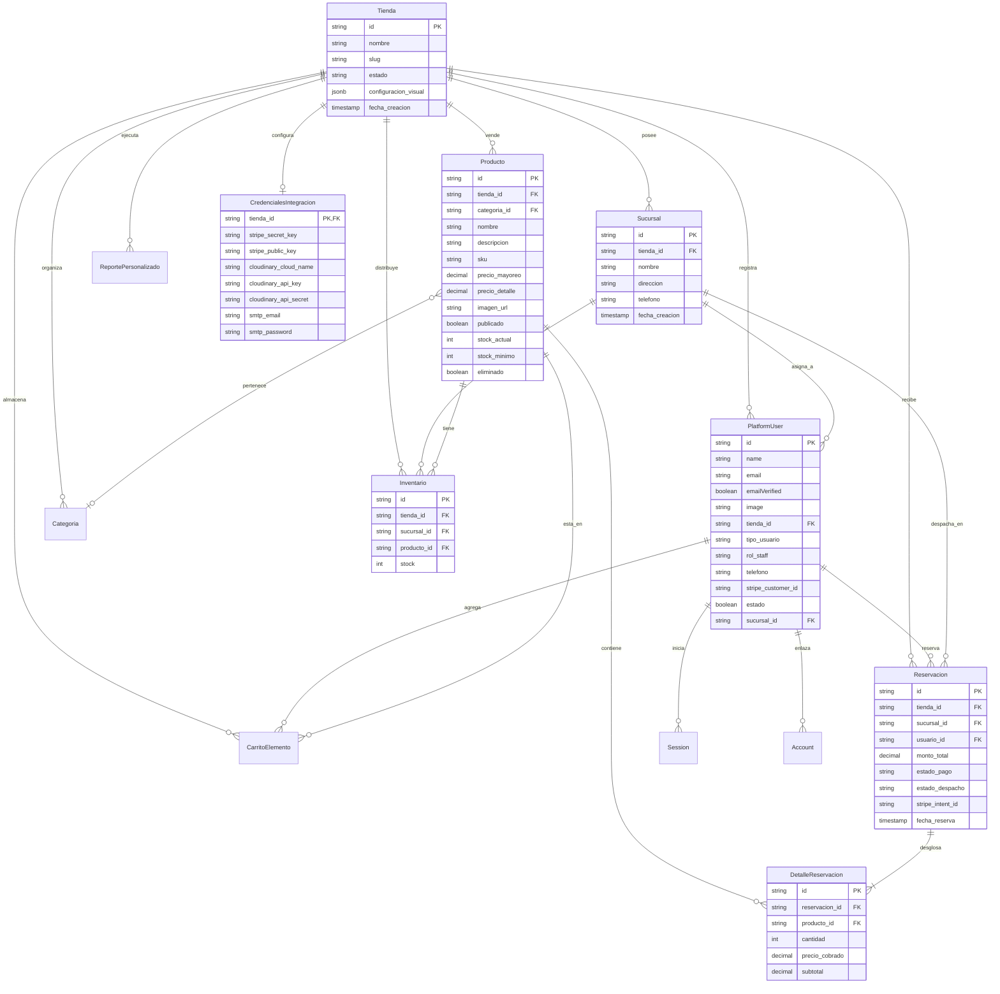

# Documentación de la Base de Datos

El sistema utiliza **PostgreSQL** (versión 16-alpine) como motor de base de datos relacional. La persistencia y el mapeo objeto-relacional (ORM) se gestionan en el backend C# con **Entity Framework Core (EF Core)**.

La arquitectura de datos está dividida en dos contextos separados con propósitos diferentes: **ElohimShopDbContext** (datos del eCommerce original) y **PlatformDbContext** (núcleo del DMV Hub con soporte multi-inquilino/multi-tenant).

---

## 1. Arquitectura de Contextos (DbContexts)

### A. PlatformDbContext (DM Hub Multi-Tenant)
Es el contexto principal de la aplicación actual. Implementa soporte nativo para múltiples tiendas (tenants) y sucursales compartiendo la misma base de datos de forma segura.

* **Filtros de Consulta Automáticos (Query Filters)**: 
  Todas las entidades ligadas a una tienda específica (`Sucursal`, `PlatformUser`, `Categoria`, `Producto`, `Inventario`, `CarritoElemento`, `Reservacion`, `ReportePersonalizado` y `CredencialesIntegracion`) configuran un filtro automático en `OnModelCreating`:
  ```csharp
  builder.HasQueryFilter(x => x.TiendaId == _tenantProvider.GetTenantId());
  ```
  Esto garantiza que cualquier consulta a la base de datos filtre de forma transparente los registros que pertenecen únicamente al tenant activo resuelto en la petición HTTP actual, previniendo fugas de información.

* **Deducción Automática de Stock (`SaveChangesAsync`)**:
  El contexto intercepta la persistencia de cambios en la entidad `Reservacion`. Cuando el estado de pago de una reservación cambia a `"pagado"`, el método sobreescrito `SaveChangesAsync` realiza de manera automática la deducción de inventario:
  1. Reduce la cantidad comprada en el `Inventario` específico de la `Sucursal` correspondiente.
  2. Reduce el stock en la tabla global de `Producto` (`StockActual`), previniendo sobreventas.

### B. ElohimShopDbContext (Módulo eCommerce Histórico)
Mapea las tablas originales del eCommerce de Esmira. Se mantiene por motivos de compatibilidad y operaciones históricas heredadas.

---

## 2. Diagrama de Relaciones (MER - Platform)

A continuación se muestra el modelo de datos del contexto unificado multi-tenant en formato Mermaid:



---

## 3. Lógica de Inicialización y Seeders

El backend contiene un flujo de arranque automático que se ejecuta al iniciar la API (en `Program.cs`):

1. **Database Schema Bootstrapper**:
   Ejecuta las migraciones pendientes en PostgreSQL para asegurar que las tablas y columnas existan y estén en la última versión.
2. **PlatformDatabaseBootstrapper & Schema Bootstrapper**:
   Crea la estructura física de la base de datos si no existe.
3. **SuperAdminSeeder**:
   Si no existe ningún superadministrador en la base de datos, lee las credenciales del archivo de configuración (o variables de entorno `SUPER_ADMIN_EMAIL` y `SUPER_ADMIN_PASSWORD`) y crea el usuario inicial con rol `superadmin`.
4. **Demo Data Seeders (PlatformDemoDataSeeder & DemoDataSeeder)**:
   Si la variable de entorno `SEED_DATA=true` está configurada, el sistema inyectará registros de prueba automatizados para verificar el funcionamiento de la plataforma:
   * Instancias de tienda demo (`esmira`, `logistics`, etc.).
   * Sucursales por tienda.
   * Categorías y productos representativos con stock e imágenes.
   * Cuentas de usuarios de staff y clientes demo (`cajero.demo@elohim.gt`, `cliente.demo@elohim.gt`, contraseña común `Demo123!`).
   * Reservaciones, ventas e inventarios iniciales para poblar los gráficos del dashboard.
