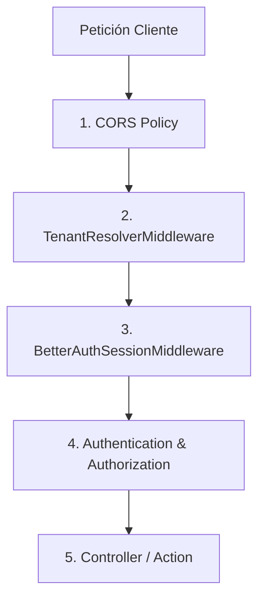

# Arquitectura de Red y Flujo de Peticiones (Middlewares)

La comunicación entre el frontend (Next.js) y el backend (ASP.NET Core API) está orquestada por una canalización de middlewares personalizada en C#. Esta canalización es la encargada de la seguridad, la resolución del inquilino activo (multi-tenant) y la validación cruzada de las sesiones de usuario.

---

## 1. Pipeline de Middlewares en el Backend

El flujo de una petición HTTP entrante sigue el siguiente orden estricto dentro de la API (definido en [Program.cs](file:///home/angc_/Dev/CC3090-inversiones-elohim-solution/backend/src/ElohimShop.API/Program.cs)):

### 1. Política CORS (`AllowFrontend`)
* **Propósito**: Permitir el acceso controlado de dominios autorizados y solicitudes preflight (`OPTIONS`).
* **Configuración**:
  * Dominios locales: `http://localhost:3000`, `http://localhost:5173`
  * Dominios de producción / IP pública: `http://20.80.105.45:3000`, `http://20.80.105.45:5000`, `http://20.80.105.45`
  * Métodos y cabeceras permitidas: Cualquiera (`AllowAnyHeader`, `AllowAnyMethod`).

---

## 2. Detalle de Middlewares Personalizados

### A. TenantResolverMiddleware
Clase: [TenantResolverMiddleware.cs](file:///home/angc_/Dev/CC3090-inversiones-elohim-solution/backend/src/ElohimShop.API/Middleware/TenantResolverMiddleware.cs)

Este middleware determina qué tienda (tenant) está realizando o recibiendo la petición. Se evalúa de manera jerárquica en base a los siguientes criterios:

1. **Cabecera Directa (`X-Tenant-ID`)**:
   Si la petición incluye `X-Tenant-ID` con un UUID de tienda válido, se resuelve directamente.
2. **Cabecera de Identificador (`X-Tenant-Slug`)**:
   Si se recibe `X-Tenant-Slug`, se busca en la base de datos la tienda coincidente ignorando los filtros globales (`IgnoreQueryFilters()`).
3. **Subdominios del Host (Subdomain Resolution)**:
   Si no se proveen cabeceras, el middleware extrae el subdominio del host:
   * Formato local 1: `tienda.localhost` -> Resuelve slug `"tienda"`.
   * Formato local 2: `tienda.lvh.me` -> Resuelve slug `"tienda"`.
   * Evita subdominios del sistema como `www`, `api`, `admin`.

**Resultado**: El ID de tienda resuelto se almacena en `HttpContext.Items["ResolvedTenantId"]`. Esto permite al `TenantProvider` suministrarlo en tiempo de ejecución al `PlatformDbContext` para aplicar los filtros automáticos de EF Core.

---

### B. BetterAuthSessionMiddleware
Clase: [BetterAuthSessionMiddleware.cs](file:///home/angc_/Dev/CC3090-inversiones-elohim-solution/backend/src/ElohimShop.Infrastructure/Auth/BetterAuthSessionMiddleware.cs)

Valida la sesión del usuario directamente contra la base de datos compartida que Better-Auth manipula desde el frontend.

1. **Extracción del Token**:
   * Primero busca en la cabecera `Authorization: Bearer <token>`.
   * Si no se encuentra, busca en las cookies de la petición: `better-auth.session_token` o `__secure-better-auth.session_token`.
2. **Validación en Base de Datos**:
   * Consulta la tabla `session` de manera global (`IgnoreQueryFilters`) incluyendo la relación con la entidad `User`.
   * Comprueba que la sesión exista, que no haya expirado (`ExpiresAt > DateTime.UtcNow`) y que el usuario esté activo.
3. **Mapeo de Inquilinos y Roles**:
   * Si el usuario pertenece a una tienda diferente a la solicitada por `X-Tenant-ID`:
     * Si es **SuperAdmin**, se le concede acceso inmediato a cualquier tienda.
     * Si es **Staff**, se valida si existe un registro de su cuenta en la tienda de destino; de lo contrario, se deniega la petición (HTTP 403 Forbidden).
     * Si es **Cliente**, se trata la solicitud como anónima para evitar fugas entre tiendas e inconsistencias en carritos.
4. **Construcción de Identidad (Claims)**:
   Se genera un `ClaimsPrincipal` con los siguientes claims fundamentales:
   * `sub` / `NameIdentifier`: ID del usuario.
   * `email`: Correo electrónico.
   * `tienda_id`: Tienda resuelta de forma efectiva.
   * `tipo_usuario`: Tipo de perfil (`staff` o `cliente`).
   * `rol` / `Role`: Permiso específico (`admin`, `cajero` o `cliente`).

El objeto `ClaimsPrincipal` se asigna a `HttpContext.User`, haciéndolo accesible para atributos de autorización estándar de C# como `[Authorize(Roles = "admin")]`.
