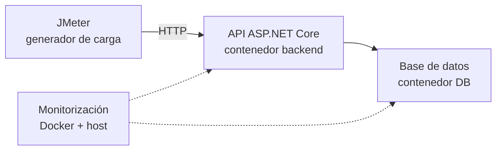

# Plan de pruebas de rendimiento con Apache JMeter

## 1. Propósito

Este documento define dos pruebas no funcionales automatizables para la API: una **prueba de carga** y una **prueba de estrés**. El propósito es medir la experiencia observada por JMeter y relacionarla con el consumo de recursos del backend y la base de datos ejecutados localmente en Docker.

> Los valores de usuarios y umbrales incluidos aquí son valores iniciales propuestos. Los resultados reales deben registrarse después de ejecutar las pruebas; no deben sustituirse por estimaciones.

## 2. Objetivos

1. Comprobar si el flujo autenticado mantiene tiempos de respuesta y errores aceptables con una carga concurrente conocida.
2. Encontrar el punto a partir del cual el endpoint de productos comienza a degradarse.
3. Medir CPU y RAM en reposo y bajo prueba para calcular el consumo adicional mediante un delta.
4. Identificar si la degradación coincide con saturación del backend, de la base de datos o de la computadora anfitriona.
5. Dejar las pruebas en archivos `.jmx` reproducibles y ejecutables desde terminal o CI/CD.

## 3. Alcance

### Incluido

- `POST /api/v1/auth/login`.
- `GET /api/v1/carrito`.
- `GET /api/v1/productos`, con paginación o filtros según los datos disponibles.
- Métricas HTTP de JMeter.
- CPU y memoria de los contenedores del backend y la base de datos.
- CPU y memoria de la máquina anfitriona para detectar si el generador de carga afecta la medición.

### Excluido inicialmente

- Pagos con Stripe.
- Webhooks.
- Carga o eliminación de archivos en Cloudinary.
- Creación masiva de reservaciones o modificaciones de inventario.

Estas operaciones generan efectos secundarios, dependen de servicios externos o pueden alterar los datos. Deben probarse en un ambiente aislado y con dobles de prueba antes de incluirlas en una prueba intensiva.

## 4. Preguntas que deben responder las pruebas

### Prueba de carga

- ¿El flujo `login → consultar carrito` funciona correctamente con 50 usuarios concurrentes?
- ¿Cuál es el tiempo de respuesta promedio, p95 y p99 de cada endpoint?
- ¿Cuántas solicitudes por segundo procesa el sistema?
- ¿Qué porcentaje de solicitudes falla?
- ¿Cuánto aumentan CPU y RAM con respecto al reposo?

### Prueba de estrés

- ¿Hasta cuántos usuarios concurrentes mantiene `GET /api/v1/productos` un rendimiento aceptable?
- ¿En qué escalón empieza la degradación?
- ¿Cuál es el último escalón aceptable, el punto de degradación y el punto de saturación?
- ¿El throughput continúa aumentando o alcanza una meseta?
- ¿Qué recurso coincide con la degradación: CPU, memoria, base de datos o la propia máquina que ejecuta JMeter?
- ¿El sistema se recupera al retirar la carga?

## 5. Arquitectura sugerida



### Opción local inicial

JMeter, Docker, backend y base de datos se ejecutan en la misma computadora. Esta opción sirve para aprender, comparar versiones y obtener un baseline local, pero el resultado expresa la capacidad de **esa configuración completa**, no la capacidad universal del sistema.

### Opción recomendada para resultados más confiables

Ejecutar JMeter en una computadora distinta y mantener la API y la base de datos en el servidor bajo prueba. Así, la CPU y RAM consumidas por JMeter no compiten directamente con la aplicación.

### Condiciones que deben permanecer constantes

- Misma versión del código y de las imágenes Docker.
- Mismos límites de CPU y memoria de los contenedores.
- Misma cantidad y distribución de datos en la base de datos.
- Mismo host, red y configuración.
- Sin procesos pesados ajenos a la prueba.
- JMeter en modo no gráfico durante la medición formal.
- Una ejecución corta de calentamiento antes de recopilar resultados.

## 6. Métricas

| Métrica | Significado | Fuente | Interpretación principal |
|---|---|---|---|
| Tiempo de respuesta (`elapsed`) | Tiempo desde el envío hasta completar la respuesta | JMeter | Experiencia total observada por el cliente |
| Latencia | Tiempo hasta comenzar a recibir la respuesta | JMeter | Espera antes del primer byte |
| Tiempo de conexión | Tiempo para establecer la conexión | JMeter | Ayuda a distinguir problemas de conexión |
| Promedio | Media de todos los tiempos | JMeter | Resumen general; puede ocultar casos lentos |
| p95 | El 95 % respondió en ese tiempo o menos | JMeter | Indicador principal de experiencia bajo carga |
| p99 | El 99 % respondió en ese tiempo o menos | JMeter | Muestra la cola de solicitudes más lentas |
| Throughput | Solicitudes completadas por unidad de tiempo | JMeter | Capacidad efectiva del sistema |
| Tasa de error | Solicitudes fallidas / solicitudes totales × 100 | JMeter | Confiabilidad bajo carga |
| Usuarios activos | Hilos virtuales simultáneos | JMeter | Concurrencia aplicada |
| CPU | Capacidad de procesamiento consumida | Docker/host | Saturación de procesamiento |
| RAM | Memoria utilizada | Docker/host | Presión o crecimiento de memoria |

Los códigos `400`, `401` o `403` causados por datos, token o tenant mal configurados son errores de la prueba, no evidencia de saturación. Cada sampler debe incluir aserciones del código HTTP y, cuando corresponda, del contenido esperado.

## 7. Medición mediante delta

El valor mostrado durante la prueba incluye el consumo normal de la aplicación. Para aproximar el consumo provocado por la carga se calcula:

```text
Delta de CPU = CPU promedio durante la carga − CPU promedio en reposo
Delta de RAM = RAM promedio durante la carga − RAM promedio en reposo
```

Ejemplo ilustrativo:

| Estado | CPU backend | RAM backend |
|---|---:|---:|
| Reposo | 4 % | 310 MiB |
| Carga | 61 % | 455 MiB |
| Delta | +57 puntos porcentuales | +145 MiB |

El delta de CPU se informa en **puntos porcentuales**, no como “57 % más”. Para una comparación relativa opcional:

```text
Incremento relativo (%) = ((valor con carga − baseline) / baseline) × 100
```

El delta no elimina completamente el ruido. Deben usarse promedios de ventanas equivalentes, por ejemplo tres minutos en reposo y tres minutos de carga estable. También deben registrarse los recursos del host, porque JMeter puede consumir CPU y RAM si corre en la misma computadora.

## 8. Protocolo común de ejecución

1. Reiniciar el ambiente de forma controlada y confirmar que la API responde.
2. Verificar usuarios, credenciales, tenant y datos de prueba.
3. Ejecutar un calentamiento corto cuyos resultados no se incluyan en el análisis.
4. Sin tráfico de JMeter, medir el baseline durante 3 minutos.
5. Ejecutar la prueba formal en modo CLI.
6. Capturar métricas Docker y del host durante toda la ejecución.
7. Mantener una fase de recuperación de 3 minutos después de retirar la carga.
8. Generar el reporte HTML y conservar el `.jtl` y las métricas del servidor.
9. Repetir cada escenario tres veces y usar la mediana de las ejecuciones para reducir el efecto del ruido.

## 9. NF-01 — Prueba de carga del flujo autenticado

### Qué se quiere hacer

Medir el tiempo de respuesta de autenticación y consulta del carrito cuando una cantidad esperada de clientes utiliza el sistema simultáneamente.

### Flujo de cada usuario virtual

1. Enviar `POST /api/v1/auth/login` con credenciales de prueba.
2. Comprobar `200 OK` y extraer el JWT de la respuesta.
3. Enviar `GET /api/v1/carrito` con `Authorization: Bearer <token>` y el identificador de tenant requerido.
4. Comprobar `200 OK` y una respuesta válida.
5. Esperar entre 1 y 3 segundos antes de repetir la consulta del carrito.

El login debe ejecutarse una vez por iteración de usuario o al inicio del flujo, según el comportamiento que se quiera representar. No debe enviarse un login antes de cada consulta si un usuario real normalmente conserva su sesión.

### Perfil de carga propuesto

| Parámetro | Valor inicial |
|---|---:|
| Usuarios concurrentes objetivo | 50 |
| Ramp-up | 60 s |
| Carga estable | 5 min |
| Recuperación observada | 3 min |
| Repeticiones formales | 3 |
| Think time | Aleatorio entre 1 y 3 s |

Antes de la ejecución formal conviene realizar ensayos de 5, 10 y 25 usuarios. Estos ensayos validan el script y evitan saltar directamente a una carga que la computadora local no pueda generar de forma estable.

### Criterios de aceptación propuestos

La ejecución pasa solamente si se cumplen todos:

| Criterio | Umbral inicial |
|---|---:|
| Respuesta correcta de login y carrito | Código esperado en el 100 % de las aserciones funcionales, salvo fallos atribuibles al sistema |
| Tasa de error total | < 1 % |
| p95 de login | ≤ 1 000 ms |
| p95 de consulta de carrito | ≤ 1 000 ms |
| p99 por endpoint | ≤ 2 000 ms |
| Timeouts | 0 |
| Contenedor reiniciado o terminado | 0 |
| Recuperación | CPU y throughput vuelven cerca del baseline en 3 min; RAM queda estable o empieza a descender |

Los umbrales de latencia son una hipótesis inicial. Después del baseline deben confirmarse con la necesidad real del proyecto y mantenerse sin modificarlos solamente para que una ejecución pase.

### Cómo declarar “con cuántos usuarios pasó”

La conclusión debe indicar la carga exacta, no solo “pasó”:

> NF-01 pasó con **___ usuarios concurrentes**, durante **___ minutos**, con p95 de login de **___ ms**, p95 de carrito de **___ ms**, tasa de error de **___ %** y throughput de **___ req/s**.

## 10. NF-02 — Prueba de estrés del endpoint de productos

### Qué se quiere hacer

Encontrar el rango operativo óptimo y el punto a partir del cual `GET /api/v1/productos` pierde rendimiento al aumentar progresivamente la concurrencia.

### Endpoint y comportamiento

- Solicitar productos con páginas y filtros válidos.
- Usar varias combinaciones representativas para evitar medir una única respuesta altamente favorecida por caché.
- Incluir el header o cookie de tenant si la configuración del ambiente lo requiere.
- Validar `200 OK` y una estructura mínima esperada.
- No realizar escrituras durante esta primera prueba de estrés.

### Perfil escalonado propuesto

| Escalón | Usuarios concurrentes | Duración estable |
|---:|---:|---:|
| 1 | 5 | 2 min |
| 2 | 10 | 2 min |
| 3 | 25 | 2 min |
| 4 | 50 | 2 min |
| 5 | 75 | 2 min |
| 6 | 100 | 2 min |
| 7 | 150 | 2 min |
| 8 | 200 | 2 min |

Los escalones son un punto de partida, no una predicción de capacidad. Si la degradación aparece temprano, se detiene y luego se prueba con incrementos más pequeños alrededor de ese punto. Si 200 usuarios siguen siendo aceptables y el host tiene margen, se diseña otra ejecución con un máximo mayor.

### Definiciones de resultado

| Concepto | Definición operativa |
|---|---|
| Último escalón aceptable | Mayor concurrencia que cumple todos los límites |
| Punto de degradación | Primer escalón donde p95 > 2 s, errores > 5 % o el throughput deja de crecer de forma útil mientras aumenta la latencia |
| Punto de saturación | Escalón donde los errores/timeouts crecen sostenidamente, el throughput cae o un recurso permanece al límite |
| Recuperación | El servicio vuelve a responder dentro de los límites al retirar la carga |

### Criterios de aceptación

La prueba de estrés busca provocar degradación; por eso “pasar” significa obtener un límite medible sin dañar el ambiente:

- Se identifica el último escalón aceptable y el primer escalón degradado.
- En el rango aceptable: p95 ≤ 2 000 ms y errores ≤ 5 %.
- Se registra throughput, p95, p99, errores, CPU y RAM en cada escalón.
- La prueba se detiene mediante las salvaguardas definidas.
- El servicio se recupera y no pierde integridad de datos.

### Cómo declarar el resultado

> El último nivel aceptable fue de **___ usuarios concurrentes**. La degradación comenzó en **___ usuarios**, cuando p95 alcanzó **___ ms**, los errores llegaron a **___ %** y el throughput cambió de **___ a ___ req/s**. En ese momento, el backend utilizó **___ % CPU** y **___ MiB RAM**, equivalentes a deltas de **___ puntos porcentuales** y **___ MiB** sobre el baseline.

## 11. Protección de la computadora local

El propósito es encontrar degradación de forma controlada, no bloquear el equipo.

### Límites de contenedores

Definir límites explícitos en Docker Compose, ajustados a la capacidad real del equipo. Ejemplo conceptual:

```yaml
services:
  backend:
    cpus: "1.50"
    mem_limit: 1g
  database:
    cpus: "1.00"
    mem_limit: 1g
```

Estos valores son ejemplos. Antes de aplicarlos se debe revisar la RAM total y reservar recursos suficientes para Ubuntu, JMeter y otras aplicaciones.

### Condiciones de parada manual o automática

Detener la ejecución si ocurre cualquiera de las siguientes condiciones:

- RAM del host ≥ 85 % durante 30 segundos.
- CPU total del host ≥ 90 % durante 60 segundos y la computadora deja de responder con normalidad.
- Swap crece continuamente o el sistema empieza a intercambiar memoria de forma intensa.
- Tasa de error ≥ 20 % durante un minuto.
- Timeouts o conexiones rechazadas crecen de forma sostenida.
- Un contenedor reinicia, muere o es terminado por falta de memoria.
- Temperatura del equipo fuera del rango seguro recomendado por su fabricante.

En `docker stats`, el porcentaje de CPU puede superar 100 % cuando el contenedor usa más de un núcleo. Por eso debe interpretarse junto con el número de CPU asignadas y con la medición del host.

## 12. Obtención de resultados

### JMeter en modo no gráfico

```bash
jmeter -n \
  -t tests/performance/load/auth-cart-load.jmx \
  -l results/load/auth-cart-load.jtl \
  -e \
  -o reports/load/auth-cart-load
```

```bash
jmeter -n \
  -t tests/performance/stress/products-stress.jmx \
  -l results/stress/products-stress.jtl \
  -e \
  -o reports/stress/products-stress
```

La GUI se utiliza para construir y depurar el plan. Las ejecuciones formales se realizan con `-n` para reducir el consumo del generador.

### Recursos de Docker

Vista interactiva:

```bash
docker stats
```

Muestras periódicas guardadas en CSV:

```bash
while true; do
  date -u +%Y-%m-%dT%H:%M:%SZ
  docker stats --no-stream --format '{{.Name}},{{.CPUPerc}},{{.MemUsage}},{{.MemPerc}}'
  sleep 5
done
```

La salida anterior todavía requiere normalización antes de calcular promedios, porque `MemUsage` contiene unidades. Debe guardarse una marca de tiempo por muestra y separar claramente baseline, calentamiento, carga estable y recuperación.

### Recursos del host Ubuntu

Herramientas útiles:

```bash
htop
free -h
vmstat 5
```

Para un registro reproducible pueden utilizarse `vmstat` o herramientas como `sar`, si están instaladas. La medición del host es indispensable cuando JMeter comparte la misma computadora con Docker.

## 13. Estructura sugerida del proyecto

```text
tests/
└── performance/
    ├── README.md
    ├── data/
    │   └── users.csv
    ├── load/
    │   └── auth-cart-load.jmx
    ├── stress/
    │   └── products-stress.jmx
    ├── scripts/
    │   ├── run-load.sh
    │   ├── run-stress.sh
    │   └── monitor-resources.sh
    ├── results/
    │   └── .gitkeep
    └── reports/
        └── .gitkeep
```

No deben almacenarse contraseñas reales ni JWT en Git. Las credenciales de prueba pueden recibirse mediante variables de entorno o mediante un CSV excluido del repositorio. Los archivos de resultados y reportes suelen ser grandes; conviene conservar los resultados importantes como artefactos de CI y excluir los temporales.

## 14. Componentes esperados en JMeter

### NF-01

- Thread Group.
- CSV Data Set Config para usuarios de prueba.
- HTTP Request Defaults.
- HTTP Header Manager para JSON y tenant.
- Sampler HTTP de login.
- JSON Extractor para el JWT.
- Header `Authorization` construido con el token extraído.
- Sampler HTTP de carrito.
- Response Assertions.
- Uniform Random Timer de 1 a 3 segundos.
- Resultados en `.jtl`; listeners pesados solo durante depuración.

### NF-02

- Un grupo de hilos escalonado mediante plugin apropiado o grupos separados por nivel.
- HTTP Request Defaults.
- Header/cookie de tenant si aplica.
- CSV Data Set Config para páginas y filtros.
- Sampler HTTP de productos.
- Response Assertions.
- Timer para controlar el ritmo si el escenario representa usuarios; sin think time si se quiere medir capacidad técnica máxima y se documenta expresamente.
- Backend Listener opcional si posteriormente se integra Prometheus/InfluxDB y Grafana.

## 15. Registro de resultados

### Baseline

| Ejecución | CPU backend | RAM backend | CPU DB | RAM DB | CPU host | RAM host |
|---|---:|---:|---:|---:|---:|---:|
| 1 |  |  |  |  |  |  |
| 2 |  |  |  |  |  |  |
| 3 |  |  |  |  |  |  |

### NF-01 — Carga

| Ejecución | Usuarios | Login p95 | Carrito p95 | p99 máx. | Throughput | Error % | Δ CPU backend | Δ RAM backend | Resultado |
|---|---:|---:|---:|---:|---:|---:|---:|---:|---|
| 1 | 50 |  |  |  |  |  |  |  |  |
| 2 | 50 |  |  |  |  |  |  |  |  |
| 3 | 50 |  |  |  |  |  |  |  |  |

### NF-02 — Estrés

| Usuarios | p95 | p99 | Throughput | Error % | CPU backend | RAM backend | CPU DB | RAM DB | Clasificación |
|---:|---:|---:|---:|---:|---:|---:|---:|---:|---|
| 5 |  |  |  |  |  |  |  |  |  |
| 10 |  |  |  |  |  |  |  |  |  |
| 25 |  |  |  |  |  |  |  |  |  |
| 50 |  |  |  |  |  |  |  |  |  |
| 75 |  |  |  |  |  |  |  |  |  |
| 100 |  |  |  |  |  |  |  |  |  |
| 150 |  |  |  |  |  |  |  |  |  |
| 200 |  |  |  |  |  |  |  |  |  |

Clasificación sugerida: `aceptable`, `degradación` o `saturación`.

## 16. Automatización

### Frecuencia sugerida

| Prueba | Automatización | Frecuencia |
|---|---|---|
| Carga | Sí; genera PASS/FAIL contra umbrales | Antes de una entrega o en pipeline programado |
| Estrés | Sí; genera métricas y localiza el límite | Manual, nocturna o semanal en ambiente aislado |

La carga no debería ejecutarse en cada commit si el runner comparte recursos o el ambiente es inestable. Una prueba corta de humo de rendimiento puede ejecutarse con mayor frecuencia y la prueba completa quedar programada.

### Parámetros configurables

Los `.jmx` deberían evitar valores rígidos y aceptar propiedades como:

```text
base_url
tenant_id o tenant_slug
users
ramp_up
duration
connect_timeout
response_timeout
```

Ejemplo:

```bash
jmeter -n -t tests/performance/load/auth-cart-load.jmx \
  -Jbase_url=http://localhost:5000 \
  -Jusers=50 \
  -Jramp_up=60 \
  -Jduration=300 \
  -l results/load/run.jtl
```

## 17. Reglas para interpretar los resultados

- Un promedio bajo no compensa un p95 o p99 excesivo.
- Más usuarios con throughput casi igual y latencia creciente indica cercanía a saturación.
- CPU alta correlacionada con latencia no demuestra por sí sola causalidad, pero orienta la investigación.
- RAM creciente durante una prueba corta no demuestra una fuga; debe observarse su estabilización y recuperación.
- Si el host está saturado, no puede concluirse que el límite pertenece solamente a la API.
- Si JMeter no logra generar la carga deseada, el resultado mide el generador y no el servidor.
- Las comparaciones solo son válidas bajo condiciones equivalentes.
- El resultado debe incluir versión del código, fecha, hardware, límites Docker y volumen de datos.

## 18. Entregables por ejecución

- Archivo `.jmx` utilizado.
- Archivo de resultados `.jtl`.
- Dashboard HTML de JMeter.
- Registro de CPU y RAM de contenedores y host.
- Tabla de baseline y deltas.
- Evidencia de códigos de error y timeouts.
- Conclusión con último nivel aceptable, degradación, saturación y recuperación.

## 19. Conclusión esperada del estudio

El informe final no debe afirmar únicamente que la API es “rápida” o “lenta”. Debe producir conclusiones medibles como estas:

> Bajo la carga objetivo de **___ usuarios concurrentes**, el flujo de autenticación y carrito **cumplió/no cumplió** los criterios establecidos. El p95 fue de **___ ms**, la tasa de error de **___ %** y el consumo adicional del backend fue de **___ puntos porcentuales de CPU** y **___ MiB de RAM**.

> En la prueba de estrés de productos, el último nivel aceptable fue **___ usuarios** y la degradación comenzó en **___ usuarios**. A partir de ese punto el throughput **continuó creciendo/se estancó/disminuyó**, mientras p95 cambió de **___ a ___ ms**. El sistema **se recuperó/no se recuperó** después de retirar la carga.

---

**Herramienta principal:** Apache JMeter  
**Ambiente inicial:** Docker local sobre Ubuntu  
**Estado:** diseño de prueba; pendiente de implementación de los `.jmx` y primera medición de baseline
